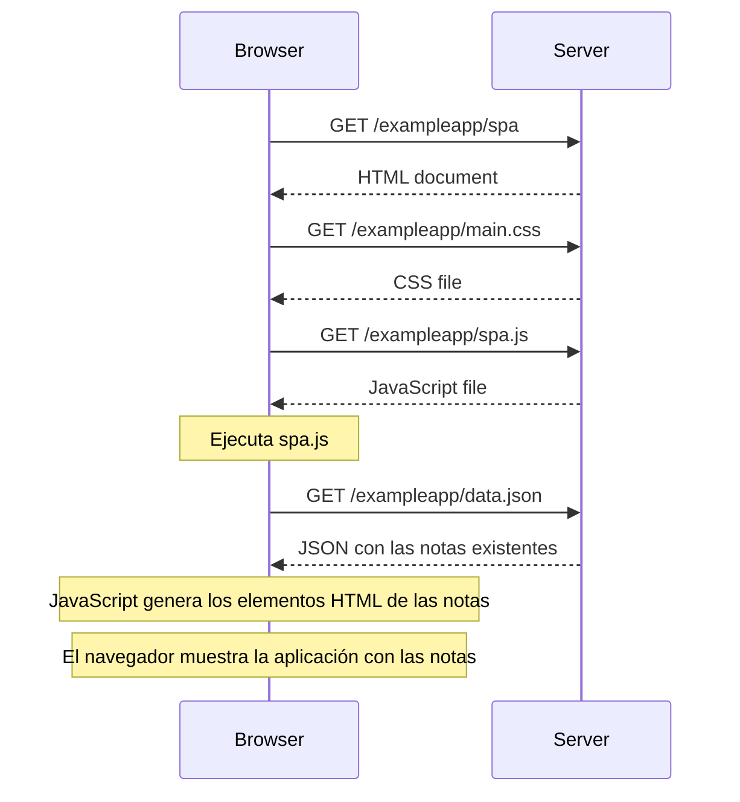

# 0.5: Single Page Application diagram

```mermaid
sequenceDiagram
    participant browser as Browser
    participant server as Server

    browser->>server: GET /exampleapp/spa
    server-->>browser: HTML document

    browser->>server: GET /exampleapp/main.css
    server-->>browser: CSS file

    browser->>server: GET /exampleapp/spa.js
    server-->>browser: JavaScript file

    Note over browser: Ejecuta spa.js

    browser->>server: GET /exampleapp/data.json
    server-->>browser: JSON con las notas existentes

    Note over browser: JavaScript genera los elementos HTML de las notas
    Note over browser: El navegador muestra la aplicación con las notas
```
